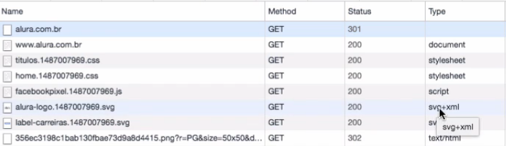
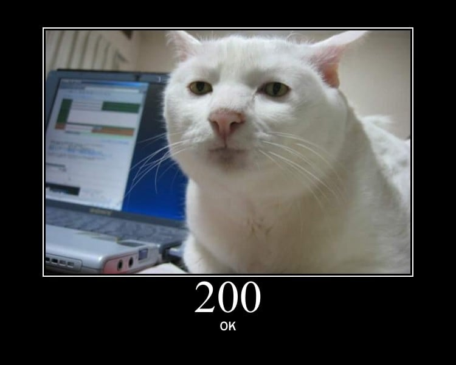
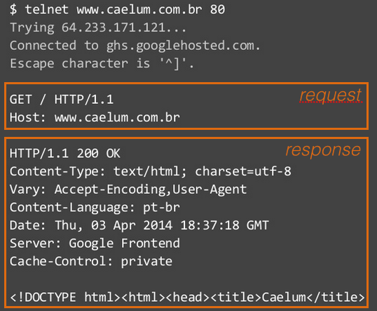
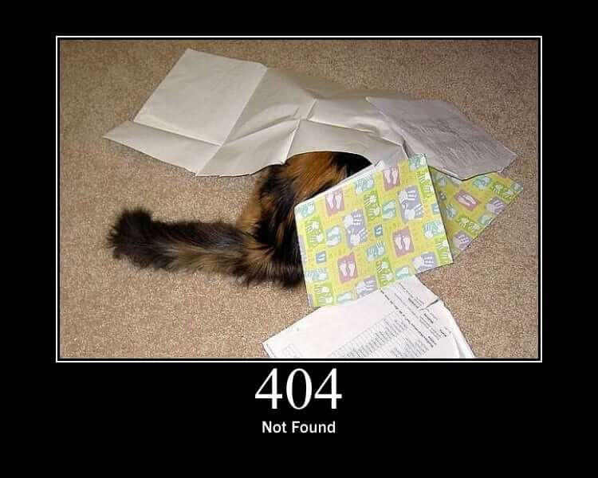
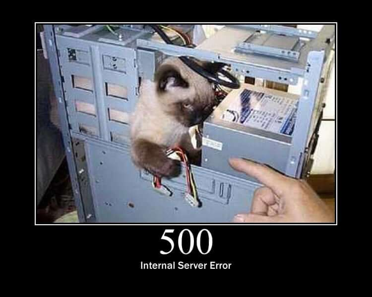

### Depurando a requisição HTTP

- Basicamente como funciona a requisição HTTP:
    - Name;
    - Method;
        - Indica a objetivo/itenção com aquela requisição;
    - Status
        - Retorna um código mostrando o resultado da requisição;
        - Vários Status;
        - https://http.cat/
    - Type (content type);
- Exemplo:     

#### Redirecionando entre sites

- Se alguém tenta acessar um site que tenha HTTPS, usando HTTP o site é movido para o protocolo HTTPS;

### O código 200

- Uns dos códigos mais comuns, significa que deu tudo certo;

#### Tipos de dados diferentes

- Quando a requisição com method get é feita o index.html é retornado;

- E a partir dele todo o conteudo que está dentro dele como imagens, css e script;

- São chamados atráves de outras requisições;

- Exemplo:
    - text/html, text/css, image/svg+xml;

#### Analisando Request e Response

- Ferramenta telnet:
    - Usando a ferramenta:
        - 
    - O telnet estabele somente uma conexão TCP;
    - A partir dessa conexão feita podemos enviar dados em cima dessa conexão;

#### Depurando Códigos e respostas

- Se eu passar um caminho que não existe ele pode dar esse status (404):
- Status 404 (Not found)
    - Não encontrou o recurso, da requisição feita;
    - ;
- Status 500 (Internal Error Server)
    - Erro mais comum nesse caso;
    - 

#### Categorias de Códigos

- Em resumo quando algum status começa com:
    - 2xx deu certo;
    - 3xx o browser precisa fazer algo a mais;
    - 4xx significa que o browser mandou algo errado;
    - 5xx caso o servidor gere algum erro;

#### Fontes

- https://www.webfx.com/web-development/glossary/http-status-codes/

- https://httpstatusdogs.com/

- https://http.cat/