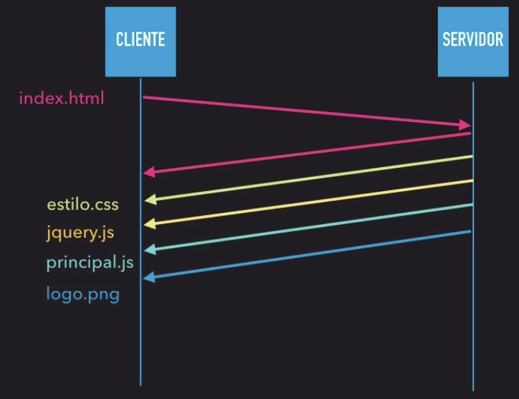

HTTP/2 surgiu com o objetivo de reduzir dados desnecessarios nas requisoes e respostas, principalmente pela questao dos dispositivos moveis nao terem uma banda de dados tao larga como os desktops podem ter.

Hpack serve para deixar o header da comunicacao;

No HTTP/1.1 o Gzip não é nativo do protocolo, no HTTP/2 ele já vem por padrão.

No HTTP/2 o uso do HTTPS é obrigatório, no HTTP/1.1 não.

No HTTP/2 os dados são trafegados em binário, no HTTP/1.1 eles são trafegados como texto.

#### Cabecalhos Stateful

- Nao preciso enviar mais os cabecarios que eu ja enviei em uma requisicao passada;
- Hpack guarda os cabecarios das requisicoes;
- a vantagem eh que por se stateful vc nao desperdica dados, sendo assim tem um custo menor por cada requisicao.
- gerando assim uma economia de dados.

- Como trafegamos apenas os headers que mudam de uma requisição para outra, acabamos por economizar uma boa quantidade de dados, pois não precisamos enviar headers que mudam poucas vezes a todo momento, como o Accept.

- Os Headers Stateful permitem que apenas os cabeçalhos que mudem sejam enviados a cada requisição, economizando muita banda que seriam cabeçalhos repetidos.

#### HTTP2 - Server Push

- Basicamente eu faco uma requisicao do index.html e o server ja me manda tudo aquilo de dependencia pra poder funcionar o index.html, entao se tiver um style.css, um script.js, jquery.js, imagens que estao linkadas com o index.html ele ja me envia, para economizar futuras requisicoes.

- **Resumo**:
    - O servidor pode empurrar para o clientes certos recursos antes mesmo de serem solicitados, pois ele consegue analisar o HTML e ver o que mais é preciso para carregar a página fazendo com que não seja necessário gastar tempo pedindo todos os outros recursos.

#### Multiplexacao

- Conexao TCP (Protocolo de Transporte);
- Uma requisicao eh unica;
    - toda vez que eu faco uma requisicao abre uma TCP e fecha;

- HTTP 1.1
    - Keep-Alive
        - Deixa 4 conexoes a 8 conexoes tcp abertas;
        - para o browser realizar o conteudo.
- HTTP 2 (Multiplexing)
    - Keep-Alive continua existindo, porem agora voce nao precisa ficar aguardando uma requisicao para puxar outra, agora ele vai faz as requisicoes em paralelo.

#### Resumo

- Algumas melhorias que o mercado pressionou;
- Header binarios e compridos (HPACK);
- .GZIP padrao na resposta (HTTP/1 -> Configurar manualmente);
- Multiplexing (Requests and responses sao paralelas);
- Server push -> Server envia dados sem eu pedir, para economizar requisicao.
