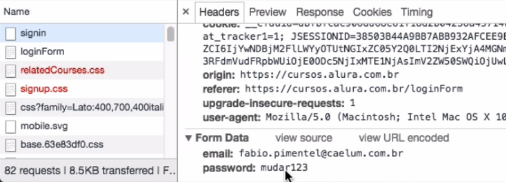

#### A web segura - HTTPS

#### Introdução

- Basicamente o HTTPS é o HTTP com uma camada de segurança;
- Dados devem ser protegidos pois a request para por algumas camadas da rede até chegar no servidor;
    - Navegador to roteador to modem to provedor to firewall to servidor;
- Como o http envia informações eu tenho que esconder essas informações, pois eu as vezes preciso passar minha senha do banco para acessar o banco, essa senha com o HTTP fica exposta;
- Ai que surge a necessidade de fazer a segurança disso.    
- Exemplo abaixo o usuario e senha ficaram sem se vulneraveis;

    

- SSL/TLS: Secure Sockets Layer / Transport Layer Security
    - Basicamente é a camada adicional que foi implementada no HTTP;
    - TLS é a mais recente;s