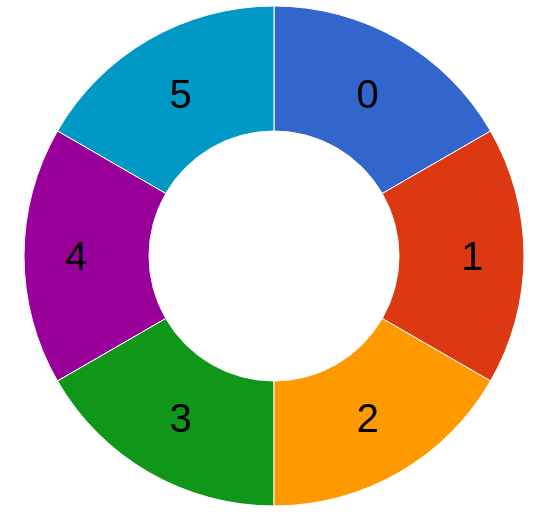
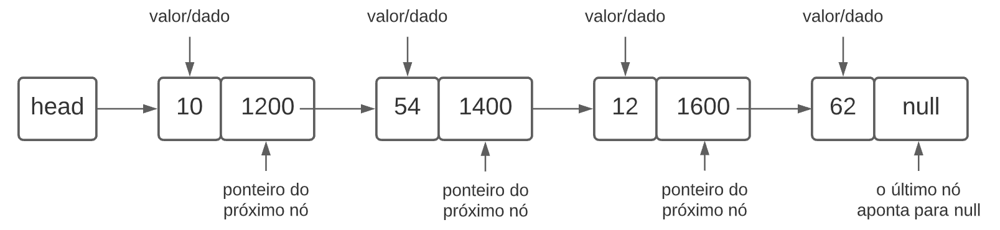

### O que são dados?

- Eles representam uma unidade ou um elemento de informação que pode ser acessado através de um identificador;
- maior parte das linguagens de programacao sao baseadas em 4 tipos de dados prismitivos:
    - int;
    - float;
    - boolean;
    - text/string;
- Cada uma tem suas particularidades, mas a base eh a mesma;

### O que são estruturas de dados?

- usamos dados em conjunto;
- a forma como esses dados vao ser organizados e utilizados depende de varios fatores:
    - eficiencia para busca;
    - o volume de dados trabalhados;
    - a complexidade da implementacao;
    - forma como dados se relacionam;
- as diversas formas de organizacao sao chamadas de estrutura de dados;

#### Caracteristicas de estrutura de dados

- cada estrutura de dados tem metodos proprios;
    - para realizar operacoes;
- lineares (ex. arrays) ou não lineares (ex. grafos);
- homogêneas (todos os dados que compõe a estrutura são do mesmo tipo) ou heterogêneas (podem conter dados de vários tipos);
- estáticas (têm tamanho/capacidade de memória fixa) ou dinâmicas (podem expandir).

### Array

- mais comum;
- vetor/matriz ou arranjo;
- uma eh lista ordenada de valores;

`const listaNumeros = [4, 6, 2, 77, 1, 0];
const listaFrutas = ["banana", "maçã", "pera"];
`
- os valores sempre sao acessados na mesma ordem;
- voce navega por posicoes;
- voce usa olha quando voce precisa organizar dados do mesmo tipo;
- existe arrays de duas dimensoes, que usam usados para processamento de imagens;

### Pilha

- similar a uma lista;
- o conceito principal eh o LIFO (Last in First Out), ou seja ultimo a entrar, primeiro a sair;
- inserir um elemento no topo da pilha;
- remover o elemento do topo da pilha;
- algumas linguagens ja tem metodos nativos para stack;
- uso das setas de voltar e avancar no browser usam esse conceito.

### Fila

- conceito parecido sobre a stack;
- FIFO (First In, First Out) primeiro a entrar, primeiro a sair;
- inserir um elemento no final da fila;
- remover um elemento no inicio da fila;
- bilheteria do cinema;
    - quem chega primeiro compra o ingresso;
    - depois a pessoa sai e o proximo compra.

### Deque

- double-ended (fila de duas pontas);
- variacao da fila;
- aceita inserir elementos e remover elementos, tanto no inicio da fila como no final;
- Podemos comparar, novamente, com uma fila de pessoas em um guichê de atendimento: uma pessoa idosa que chega é atendida antes (ou seja, não pode ser colocada no fim da fila), ao mesmo tempo que uma pessoa que entrou no final da fila pode desistir de esperar e ir embora (nesse caso, não podemos esperar a pessoa chegar na frente da fila para retirá-la de lá).

### Fila circular

- circular queue;
- onde o ultimo elemento eh conectado com o primeiro elemento;
- 
- tem objetivo de lidar com espacos vazios, que pode sem enfileirar apos a retirada, de elementos do inicio da fila;
- alt-tab usa esse principio;

### Lista ligada

- Arrays tem tamanho fixo;
- lista ligads nao tem restricoes de tamanho;
- inserir ou remover elementos no meio de um array, requer deloscamento de elementos;
- lista ligadas usam ponteiros para unir os elementos;
- cada elemento aponta para o endereco de memoria do proximo elemento da lista;
- nao ha necessidade de deslocamento de elementos ao inserir ou remover, pois os elementos sao encadeados por ponteiros;
- albuns de fotos;
- playlists de musica ou video;
- 

### Conjunto

- eh uma lista nao ordenada de elementos unicos;
- onde voce nao consegue repetir valores;
- muitas linguagens mais usadas ja tem metodos nativos para criar conjuntos;
   ```javascript
    const lista = [1, 1, 1, 3, 5, 7, 9];
    const conjunto = new Set(lista);
    console.log(conjunto); // Set(5) { 1, 3, 5, 7, 9 }
    ```
- baseado na conjunto matematico;
- utilizado em um banco de dados SQL;
- interseccao, uniao de elementos;


### Dicionarios ou hashmap


### Arvore

### Grafo

### Conclusao


